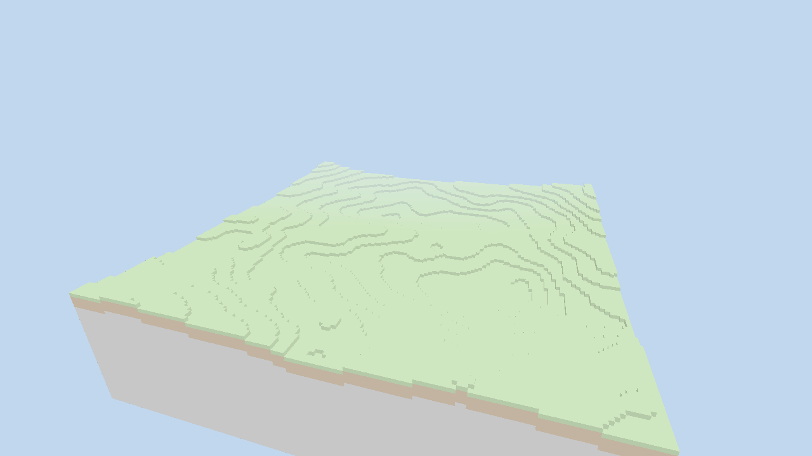

# Lost Horizons C++23 — Voxel Engine (v0.2.0)

The **Lost Horizons** voxel engine, written in **modern C++23** with **Vulkan**.
v0.1.0 delivered the foundation (engine core, renderer, window). **v0.2.0** adds
a **free-fly camera**, **frustum culling** and **smoother procedural terrain**.

> The original game design documents referenced a Godot/Python prototype. The
> production engine targets **C++23 + Vulkan** (see `BUILD_INSTRUCTIONS`,
> `VERSION_0.2.0`, `PRESENTATION` design docs). This repository implements that
> C++23 engine from the ground up.



## What's in v0.2.0

| Area | Implemented |
|------|-------------|
| **Camera** | Free-fly FPS camera: WASD + Q/E, Shift/Ctrl speed, mouse look, scroll zoom, smoothed velocity (auto-orbit retained for headless runs) |
| **Frustum culling** | Per-chunk AABB vs 6-plane view-frustum test; off-screen chunks are skipped each frame |
| **Terrain** | Smoother rolling hills: 5-octave fBm, box-filtered height field, smoothstep rounding, water/sand/snow bands |

### Inherited from v0.1.0

| Area | Implemented |
|------|-------------|
| **Window** | GLFW window configured for Vulkan, resize handling, input |
| **Renderer** | Full Vulkan pipeline: instance, device, swapchain, depth buffer, render pass, graphics pipeline, command buffers, synchronization, frames-in-flight |
| **Engine core** | Main loop, timing/FPS, EnTT ECS registry (one entity per chunk) |
| **Voxel world** | Dense chunk storage, procedural fractal-noise terrain, materials (stone/dirt/grass/sand/water/snow) |
| **Meshing** | Face-culled CPU mesher → device-local GPU vertex/index buffers |
| **Shaders** | GLSL → SPIR-V, directional lighting + ambient + distance fog |

## Controls (interactive run)

| Input | Action |
|-------|--------|
| `W` / `A` / `S` / `D` | Move forward / left / back / right |
| `E` / `Q` | Move up / down |
| `Shift` / `Ctrl` | Fast (4×) / slow (0.25×) movement |
| Mouse | Look around |
| Scroll | Zoom (FOV) |
| `ESC` | Release / re-capture the cursor |

Still planned per the design docs: a 5-level LOD system, the ImGui debug UI and
multi-threaded chunk generation.

## Architecture

```
include/ + src/
├── core/        Window (GLFW), Engine loop, Camera, Logger
├── rendering/   Vertex format, VulkanRenderer (Init/Swapchain/Pipeline/Render)
├── voxel/       VoxelData, TerrainGenerator, ChunkMesher, World
└── ecs/         Components (Transform, Mesh, Chunk)
shaders/         voxel.vert, voxel.frag
```

The renderer is split across `VulkanRenderer_{Init,Swapchain,Pipeline,Render}.cpp`
by responsibility, following the layout in the design docs.

## Prerequisites (Ubuntu/Debian)

```bash
sudo apt install -y build-essential cmake ninja-build g++-13 \
    libglfw3-dev libglm-dev libvulkan-dev glslang-tools \
    mesa-vulkan-drivers vulkan-tools
```

Requires a C++23 compiler (GCC 13+ / Clang 17+), CMake 3.20+ and the Vulkan SDK
(headers + `glslangValidator`). `EnTT` is fetched automatically by CMake.

## Build

```bash
./build.sh                 # configures + builds into ./build
# or manually:
cmake -S . -B build -G Ninja -DCMAKE_CXX_COMPILER=g++-13
cmake --build build --parallel
```

## Run

```bash
./build/bin/LostHorizons
```

Environment variables:

| Variable | Effect |
|----------|--------|
| `LH_SEED` | Terrain generation seed (default `1337`) |
| `LH_MAX_FRAMES` | Render N frames then exit (`0` = run until window closes). Used for headless/CI smoke tests. |

### Headless / software rendering

No GPU? Use Mesa's software Vulkan (lavapipe) under a virtual display:

```bash
Xvfb :99 -screen 0 1280x720x24 &
DISPLAY=:99 VK_ICD_FILENAMES=/usr/share/vulkan/icd.d/lvp_icd.x86_64.json \
    LH_MAX_FRAMES=120 ./build/bin/LostHorizons
```

## Roadmap

- **v0.1.0** — engine core, Vulkan renderer, window, procedural voxel terrain.
- **v0.2.0 (this release)** — free-fly camera (WASD + mouse), frustum culling, smoother terrain.
- **v0.2.x** — 5-level LOD system, ImGui debug UI, multi-threaded chunk generation.
- **v0.3.0+** — compute meshing, physics, chunk streaming, networking (see design docs).
